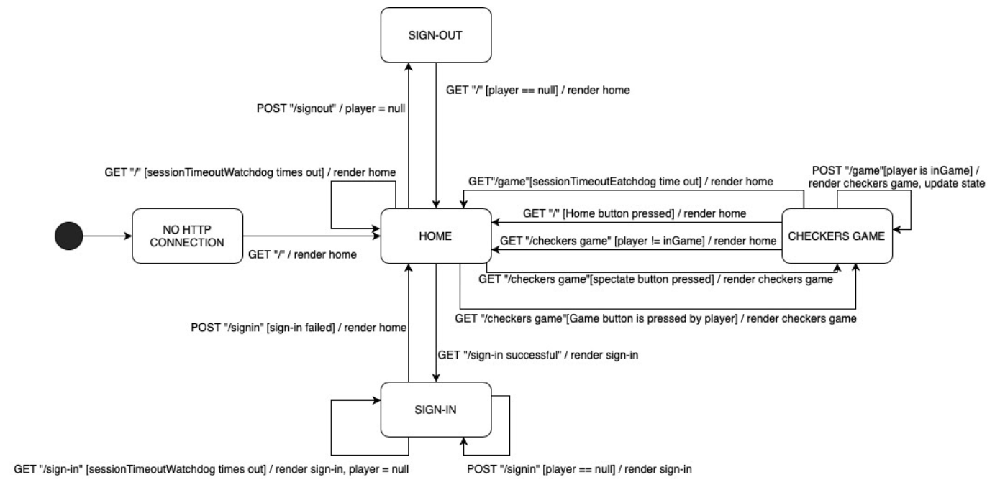

# PROJECT Design Documentation

## Team Information
* Team name: Waffles
* Team members:
  * Beck Anderson
  * Dhruv Rajpurohit
  * Kelly Xiong Chen
  * Marcus Kapoor

## Executive Summary
This project is creating a web based application called Webcheckers. Webcheckers is modeling a game of checkers on the web. To play the game the user must sign in with unique id. The user can compete in the game of checkers with other online players, in addition to that the user can spectate another game, help the player while spectating. Playing the game involves both players to move their piece one by one. The game governs by the American rules of checkers. 
 
### Purpose
The purpose of this project is create a web based application which follows the software development principles. The user goals of this project to provide a very efficient and exciting experience of the web based checkers game. The most important user groups of this project are the ones who have a similat interest towards the game of checkers.

### Glossary and Acronyms

| Term | Definition |
|------|------------|
| VO | Value Object |
| MVP | Minimum Viable Product |

## Requirements

In the Minimum Viable Product (MVP), the player is able to sign in with a 
valid username. Once doing so, the player has the option to start a game 
or spectate an occurring one. During gameplay and it is a player’s turn, 
the player is able to move their piece forward, reverse its previous action,
 and then submit their turn. The player is given the ability to resign as well. 

### Definition of MVP
Minimum Viable Product (MVP) is where we have a version of the product with at 
least its minimum functionality. It is “enough” in the sense that the product 
is able to run successfully and we can reflect on it to see if there is anything
 else we add to it. Through having a MVP, this can also lead to less time on other
  unnecessary features at the moment. _

### MVP Features
- Stories: 
    -  Sign in 
    -  Start a Game 
- Epic: Gameplay
    - Piece Forward Movement 
    - Piece Capture 
    - King-ify Piece 
    - Piece Reverse Movement 
    - Game Win

### Roadmap of Enhancements
- Epic: Spectate 
    - Game Share  
    - Live View 
- Epic: Replay 
    - Select a Game 
    - Watch a Game 

## Application Domain

The diagram is the domain model of the application and the fundamental 
structure of the web based application. In order for the application to 
function properly, it will be structured in a similar manner as depicted 
in the diagram. To play the game the user is supposed to have a unique 
username. The user can either be a spectator or play the game with 
another player. The game is played on the 8 by 8 board which consists of 
64 squares, either dark or light. Players have 12 checkers pieces each which 
are either red or black. The user is supposed to make a move on the dark 
square. Every move manipulates the checkers piece’s location on the square. 
The spectator can watch the game while two different players are playing 
the game and also has an option of suggesting a player of their choice 
with the next move. 

## Architecture and Design

This section describes the application architecture.

### Summary

The following Tiers/Layers model shows a high-level view of the webapp's architecture.

As a web application, the user interacts with the system using a
browser.  The client-side of the UI is composed of HTML pages with
some minimal CSS for styling the page.  There is also some JavaScript
that has been provided to the team by the architect.

The server-side tiers include the UI Tier that is composed of UI Controllers and Views.
Controllers are built using the Spark framework and View are built using the FreeMarker framework.  The Application and Model tiers are built using plain-old Java objects (POJOs).

Details of the components within these tiers are supplied below.

### Overview of User Interface

This section describes the web interface flow; this is how the user views and interacts
with the WebCheckers application.

The diagram shows the interface the user will experience while using the 
application. The interface has three main pages, they are the home page, 
the sign in page and the game page. The game starts by asking the user 
to sign in with a unique username. Post sign in the user is redirected 
to the home page where they can see the players online. The user can then
 challenge a player or wait to be challenged by another player. Once the 
 player has either challenged another player or is challenged by another 
 player, they are redirected to the game page where they can see the game 
 board. The player with red pisces makes the first move and then the other 
 player makes a move and this goes on until the game is over. If the player 
 has not made any kind of actions in a while, their session has timed out 
 and they are automatically redirected to the home page. 

### UI Tier
This sequence chart displays the components that take place and their progression
 throughout the application. It starts off with the component at the upper left of
  this diagram. We are starting from when a player has logged in successfully. Once
   doing so, the player gets to see who is playing or is willing to play. If a player
    is in the middle of a game, a message about a user being busy (userBusy) would 
    appear. Otherwise, a game is created and the player would be redirected to the 
    actual game page. When two players are being put into a game, their colors (red or 
    white) and the game board are displayed. Then, the game starts and follows the 
    rules of a checkers game. Red player goes first and then the white player. 

### Application Tier
These classes are where the user/player is being directed into a lobby filled 
with other players and if there is another available player, then both players 
are put into a game. However, there are more behind the scene events happening. 
A player has a name and overrides the equals method. Knowing this, this player 
is put into a player lobby. If an available player is connected with another 
available player (isPlayerActive and isPlayerInGame), a game is created and 
both players are redirected to the game page/board (createGame). One player 
is assigned to the red color and the other is white. Once in the game, the 
players take turns while following the rules of checkers. Players can let each 
other know when their turn is done and resign from a game. At the end of the 
game, the winner is displayed. 

### Model Tier
In the earlier two tier, this was said: “follow the game of checkers”. This 
diagram shows more in-depth of that process. Within this process, the red 
and white players have their game view loaded. The game view consists of a 
checkerboard, which is where the rows and pieces component comes into play. 
When it is their turn, they will see an active color. Players should see their 
pieces move from one valid box to another. This repeats until there is a winner.  

### Design Improvements
During Sprint 4, we are going to be “cleaning up” our code. This means we are seeing 
how else we can improve the code in terms of its efficiency. It can be as simple as 
making sure every part of the code is being used, otherwise, it is discarded. On the 
other hand, this can be a greater task where we are reorganizing our code if we found 
a better method of programming the product. In addition, we are going to add purposeful 
comments along the way. When commenting, we can work through what the code is doing and 
then maybe we can find possible bugs and other areas to improve that way. 

## Testing
In this process, we repeatedly used our program with the intention of finding ways to 
break it. A few examples of this would be when we attempted to give invalid usernames, 
made invalid game moves, pushed all of the buttons, and continuously refreshed the page 
to see if there are any time where the player would be stuck in between states. By doing 
this, we made sure we had a MVP and beyond. 

### Acceptance Testing

For the most part, we are doing well in terms of code metrics. A part we can work on more 
is BoardView. A lot is going on with this aspect of the program. This can be extended to 
GetGameRoute and PostSubmitTurnRoute.  

### Unit Testing and Code Coverage
As mentioned in the “Testing” section above, we have covered a wide range of errors that 
can happen. Some of them being invalid usernames, game moves, buttons being pressed, and etc. 
For invalid usernames, we used symbols, left it blank, used another player’s username, and more. 
For game moves, we tried going on an occupied space and wrong space.
